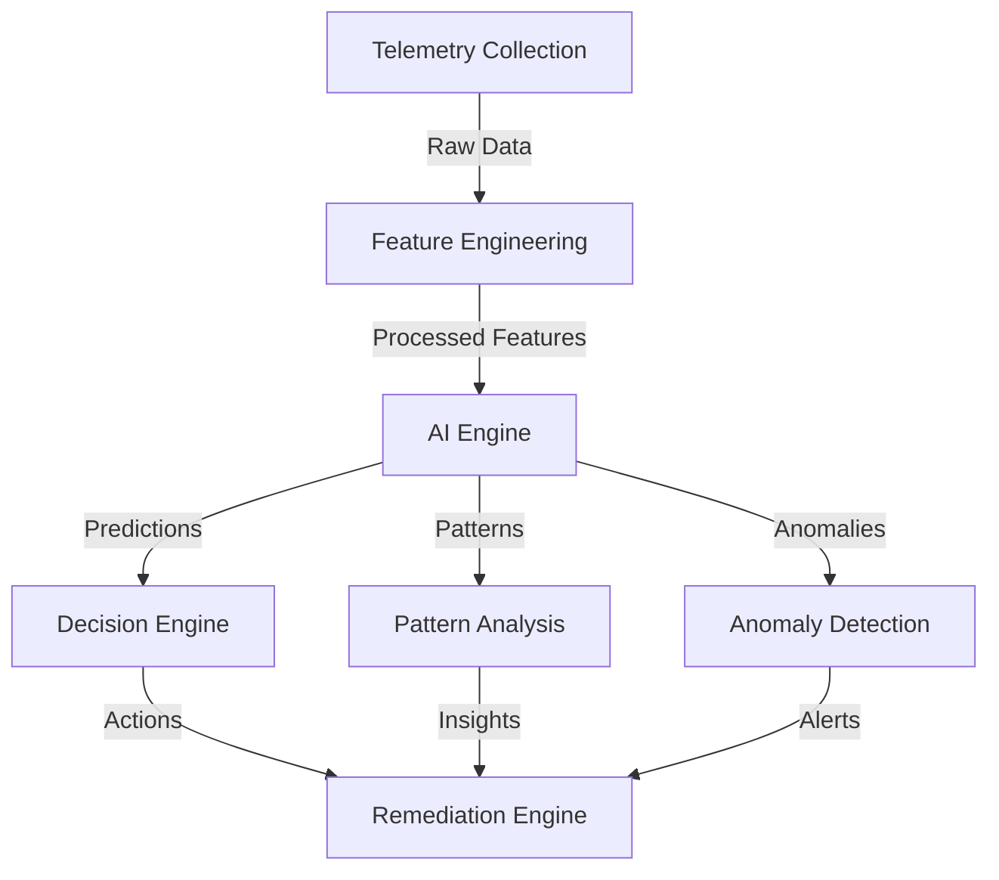
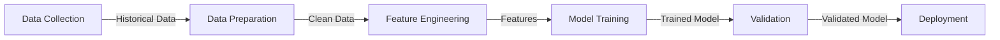

# AI Components Documentation

## Overview

The Azure Arc Framework includes advanced AI capabilities for predictive analytics, pattern recognition, and automated remediation. This document details the AI components and their integration within the framework.

## Architecture



## Components

### 1. Feature Engineering

The feature engineering component processes raw telemetry data into meaningful features for AI analysis.

```python
class FeatureEngineer:
    def engineer_features(self, data):
        """
        Transforms raw telemetry into AI-ready features
        
        Parameters:
        - data: Raw telemetry data
        
        Returns:
        - Engineered features
        - Feature metadata
        """
```

#### Feature Types
- Performance Metrics
- Health Indicators
- Security Metrics
- Configuration States
- Temporal Features

### 2. Prediction Engine

Handles predictive analytics for various aspects of Arc agent health and performance.

#### Models
1. Health Prediction
   ```python
   def predict_health(telemetry):
       """
       Predicts agent health status
       
       Returns:
       - Health score (0-1)
       - Contributing factors
       - Confidence level
       """
   ```

2. Failure Prediction
   ```python
   def predict_failures(telemetry):
       """
       Predicts potential failures
       
       Returns:
       - Failure probability
       - Time to failure
       - Critical components
       """
   ```

### 3. Pattern Recognition

Identifies patterns in telemetry data for proactive management.

```python
class PatternAnalyzer:
    def analyze_patterns(self, data):
        """
        Identifies recurring patterns
        
        Returns:
        - Pattern types
        - Frequency
        - Impact
        """
```

#### Pattern Types
- Performance Patterns
- Error Patterns
- Usage Patterns
- Security Patterns

### 4. Anomaly Detection

Detects unusual behavior and potential issues.

```python
class AnomalyDetector:
    def detect_anomalies(self, data):
        """
        Identifies anomalous behavior
        
        Returns:
        - Anomaly score
        - Affected components
        - Severity level
        """
```

## Integration

### 1. PowerShell Integration

The framework integrates AI capabilities through several PowerShell functions. Key functions include:

- **Core Functions**:
    - `Initialize-ArcDeployment`: Sets up the initial parameters for an Arc deployment.
    - `New-ArcDeployment`: Deploys a new Arc agent to a server.
- **AI Functions**:
    - `Get-PredictiveInsights`: Retrieves predictive insights for a given server. Currently, this function returns placeholder data pending full AI model integration.
    - `Invoke-AIPatternAnalysis`: Analyzes telemetry data to identify patterns.
    - `Start-AIEnhancedTroubleshooting`: Initiates an AI-driven troubleshooting workflow.

The module manifest (`AzureArcFramework.psd1`) correctly lists `Start-ArcTroubleshooter` as the function for initiating troubleshooting workflows.

```powershell
# Example: Initialize AI components (conceptual)
# $ai = Initialize-AIComponents -Config $AIConfig

# Get predictive insights for a server
$serverInsights = Get-PredictiveInsights -ServerName "MyArcServer"

# Analyze patterns from telemetry data
# $patterns = Invoke-AIPatternAnalysis -Data $telemetryData
```

### 2. Automation Integration

```powershell
# AI-driven remediation
Start-AIRemediationWorkflow -ServerName $ServerName -Insights $insights

# Automated decision making
Invoke-AIDecision -Context $context -Options $options
```

## Model Training

### 1. Training Process



### 2. Model Updates

```python
def update_model(new_data):
    """
    Updates model with new training data
    
    Parameters:
    - new_data: New training data
    
    Returns:
    - Updated model metrics
    """
```

## Python AI Engine Details

This section details recent updates to the core Python classes forming the AI engine. Many of these components are currently using placeholder logic and data, serving as a structural foundation for future full-fledged AI model integration.

### RootCauseAnalyzer
The `RootCauseAnalyzer` now initializes with placeholder instances for its machine learning model (`ml_model = MLModelPlaceholder()`) and its explanation component (`explainer = ExplainerPlaceholder()`). These placeholders simulate the behavior of a trained ML model and an explainable AI component, allowing the overall workflow to be tested.

### PatternAnalyzer
The `PatternAnalyzer` has been significantly expanded with several new methods to identify various types of patterns in telemetry data. These methods currently implement placeholder logic and return simulated pattern data:
- `analyze_daily_patterns`: Analyzes for daily trends and seasonality.
- `analyze_weekly_patterns`: Analyzes for weekly trends.
- `analyze_monthly_patterns`: Analyzes for monthly cycles.
- `identify_common_failure_causes`: Identifies frequent causes of failures.
- `identify_failure_precursors`: Detects sequences of events that may lead to failures.
- `analyze_failure_impact`: Assesses the potential impact of identified failures.
- `analyze_resource_usage_patterns`: Analyzes how resources are utilized over time.
- `identify_bottlenecks`: Pinpoints potential performance bottlenecks.
- `analyze_performance_trends`: Tracks trends in performance metrics.

The parent methods `analyze_failure_patterns` and `analyze_performance_patterns` have also been updated to include a `recommendations` key in their output, populated with placeholder recommendations.

### TelemetryProcessor
The `TelemetryProcessor` includes several new internal methods for processing telemetry data. These methods currently use placeholder logic:
- `_handle_missing_values`: Fills or removes missing data points.
- `_prepare_feature_matrix`: Transforms features into a numerical matrix for model input.
- `_get_anomalous_features`: Identifies features contributing to an anomaly.
- `_calculate_period_trends`: Calculates trends over specific time periods.
- `_detect_periodic_patterns`: Detects recurring patterns.
- `_detect_correlations`: Finds correlations between different metrics.
- `_detect_anomalous_patterns`: Identifies unusual sequences or combinations of events.
- `_generate_anomaly_insights`: Creates human-readable insights from detected anomalies.
- `_generate_trend_insights`: Creates insights from detected trends.
- `_calculate_derived_features`: Computes new features from existing data (e.g., error rates).

### ArcRemediationLearner & ArcModelTrainer
- **ArcRemediationLearner**: In the `learn_from_remediation` method, the model update call has been changed from `self.model.partial_fit(...)` to `self.model.fit(...)`. This reflects an iterative single-sample update approach suitable for the current placeholder model.
- **ArcModelTrainer**: A new placeholder method `update_models_with_remediation` has been added. This method is intended to eventually allow models to learn from the outcomes of remediation actions.

### FeatureEngineer
The `FeatureEngineer` component has received the following updates:
- In `_encode_categorical_features`, the `OneHotEncoder` initialization was changed from `sparse=False` to `sparse_output=False` to align with updated scikit-learn parameter names.
- In `_create_statistical_features`, methods for calculating rolling statistics (mean, std, max, min), lag features, difference features, and percentage change features now include `.fillna(0)` to handle NaN values that can arise at the beginning of series or from certain calculations.

### Predictor
The `Predictor` component's `calculate_feature_impacts` method has been updated to correctly use numerical indices when accessing feature values from the `prepared_features_array` (NumPy array). Previously, it attempted to use feature names, which would fail. The method now assumes the order of features in the `feature_importance` dictionary matches the column order in `prepared_features_array`. Warnings have been added to log potential issues if this order assumption is violated or if array dimensions don't match. The `prepare_features` method still uses hardcoded feature lists, and this dependency is acknowledged as a risk.

## Configuration

### 1. AI Configuration
The main AI configuration file, `src/config/ai_config.json`, has been updated to include new sections essential for the expanded AI capabilities:
- **`clustering`**: Configuration for pattern analysis clustering (e.g., `eps`, `min_samples` for DBSCAN in `PatternAnalyzer`).
- **`feature_engineering`**: Parameters for the `FeatureEngineer` (e.g., `rolling_window` size, `lags` to generate).
- **`model_config`**: Contains detailed configurations for model training, structured into:
    - `features`: Defines required features, missing value strategies, and target columns for different model types (`health_prediction`, `anomaly_detection`, `failure_prediction`).
    - `models`: Specifies hyperparameters for each model type (e.g., `n_estimators`, `max_depth` for Random Forest models, `contamination` for Isolation Forest).

```json
{
    "models": {
        "health_prediction": {
            "type": "RandomForest",
            "threshold": 0.7,
            "features": ["cpu", "memory", "network"]
        },
        "anomaly_detection": {
            "type": "IsolationForest",
            "contamination": 0.1
        }
    },
    "training": {
        "batch_size": 1000,
        "epochs": 10,
        "validation_split": 0.2
    }
}
```

### 2. Feature Configuration

```json
{
    "features": {
        "performance": {
            "cpu_usage": {"type": "numeric", "range": [0, 100]},
            "memory_usage": {"type": "numeric", "range": [0, 100]},
            "disk_usage": {"type": "numeric", "range": [0, 100]}
        },
        "health": {
            "service_status": {"type": "categorical", "values": ["Running", "Stopped"]},
            "connection_status": {"type": "categorical", "values": ["Connected", "Disconnected"]}
        }
    }
}
```

## Best Practices

### 1. Model Management
- Regular model retraining
- Performance monitoring
- Version control
- Validation procedures
- Deployment strategies

### 2. Feature Engineering
- Data normalization
- Feature selection
- Dimensionality reduction
- Missing data handling
- Outlier detection

### 3. Integration
- Error handling
- Logging
- Performance optimization
- Resource management
- Security considerations

## Troubleshooting

### 1. Common Issues

#### Model Performance
```powershell
# Check model performance
Test-AIModelPerformance -ModelType "HealthPrediction"

# Validate predictions
Test-PredictionAccuracy -Predictions $predictions
```

#### Feature Engineering
```powershell
# Validate features
Test-FeatureQuality -Features $features

# Check data quality
Test-DataQuality -TelemetryData $telemetryData
```

### 2. Diagnostics

```powershell
# Get AI component status
Get-AIComponentStatus

# Export diagnostic data
Export-AITelemetry -Path ".\Diagnostics"
```

## Performance Optimization

### 1. Resource Usage
- Batch processing
- Caching strategies
- Memory management
- CPU optimization
- Parallel processing

### 2. Scaling
- Load balancing
- Resource allocation
- Queue management
- Buffer handling
- Throttling mechanisms

## Security Considerations

### 1. Data Protection
- Data encryption
- Access control
- Audit logging
- Data retention
- Privacy compliance

### 2. Model Security
- Input validation
- Output sanitization
- Model versioning
- Access controls
- Audit trails

## Monitoring and Metrics

### 1. Performance Metrics
```powershell
# Get AI performance metrics
Get-AIMetrics -TimeRange "24h"

# Monitor prediction accuracy
Get-PredictionMetrics -ModelType "HealthPrediction"
```

### 2. Health Monitoring
```powershell
# Monitor AI component health
Get-AIComponentHealth

# Check model health
Test-ModelHealth -ModelType "FailurePrediction"
```

## Future Enhancements

### 1. Planned Features
- Enhanced pattern recognition
- Real-time prediction updates
- Automated model optimization
- Advanced anomaly detection
- Integrated feedback loops

### 2. Integration Points
- Additional data sources
- External AI services
- Custom model support
- Enhanced visualization
- Advanced reporting