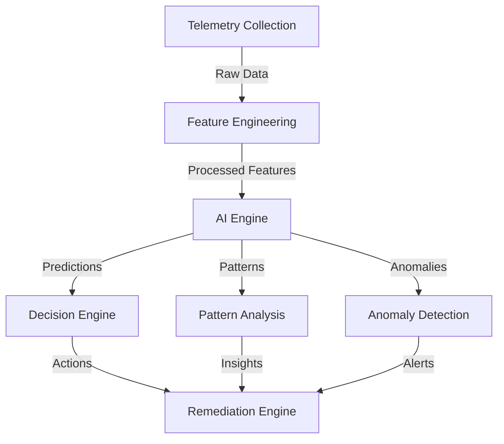
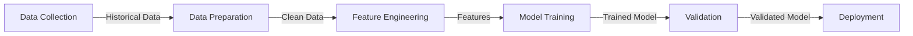

# AI Components Documentation

## Overview

The Azure Arc Framework includes advanced AI capabilities for predictive analytics, pattern recognition, and automated remediation. This document details the AI components and their integration within the framework.

## Architecture



## Components

### 1. Feature Engineering

The feature engineering component processes raw telemetry data into meaningful features for AI analysis.

```python
class FeatureEngineer:
    def engineer_features(self, data):
        """
        Transforms raw telemetry into AI-ready features
        
        Parameters:
        - data: Raw telemetry data
        
        Returns:
        - Engineered features
        - Feature metadata
        """
```

#### Feature Types
- Performance Metrics
- Health Indicators
- Security Metrics
- Configuration States
- Temporal Features

### 2. Prediction Engine

Handles predictive analytics for various aspects of Arc agent health and performance.

#### Models
1. Health Prediction
   ```python
   def predict_health(telemetry):
       """
       Predicts agent health status
       
       Returns:
       - Health score (0-1)
       - Contributing factors
       - Confidence level
       """
   ```

2. Failure Prediction
   ```python
   def predict_failures(telemetry):
       """
       Predicts potential failures
       
       Returns:
       - Failure probability
       - Time to failure
       - Critical components
       """
   ```

### 3. Pattern Recognition

Identifies patterns in telemetry data for proactive management.

```python
class PatternAnalyzer:
    def analyze_patterns(self, data):
        """
        Identifies recurring patterns
        
        Returns:
        - Pattern types
        - Frequency
        - Impact
        """
```

#### Pattern Types
- Performance Patterns
- Error Patterns
- Usage Patterns
- Security Patterns

### 4. Anomaly Detection

Detects unusual behavior and potential issues.

```python
class AnomalyDetector:
    def detect_anomalies(self, data):
        """
        Identifies anomalous behavior
        
        Returns:
        - Anomaly score
        - Affected components
        - Severity level
        """
```

## Integration

### 1. PowerShell Integration

```powershell
# Initialize AI components
$ai = Initialize-AIComponents -Config $AIConfig

# Get predictive insights
$insights = Get-PredictiveInsights -ServerName $ServerName

# Analyze patterns
$patterns = Invoke-AIPatternAnalysis -Data $telemetryData
```

### 2. Automation Integration

```powershell
# AI-driven remediation
Start-AIRemediationWorkflow -ServerName $ServerName -Insights $insights

# Automated decision making
Invoke-AIDecision -Context $context -Options $options
```

## Model Training

### 1. Training Process



### 2. Model Updates

```python
def update_model(new_data):
    """
    Updates model with new training data
    
    Parameters:
    - new_data: New training data
    
    Returns:
    - Updated model metrics
    """
```

## Configuration

### 1. AI Configuration

```json
{
    "models": {
        "health_prediction": {
            "type": "RandomForest",
            "threshold": 0.7,
            "features": ["cpu", "memory", "network"]
        },
        "anomaly_detection": {
            "type": "IsolationForest",
            "contamination": 0.1
        }
    },
    "training": {
        "batch_size": 1000,
        "epochs": 10,
        "validation_split": 0.2
    }
}
```

### 2. Feature Configuration

```json
{
    "features": {
        "performance": {
            "cpu_usage": {"type": "numeric", "range": [0, 100]},
            "memory_usage": {"type": "numeric", "range": [0, 100]},
            "disk_usage": {"type": "numeric", "range": [0, 100]}
        },
        "health": {
            "service_status": {"type": "categorical", "values": ["Running", "Stopped"]},
            "connection_status": {"type": "categorical", "values": ["Connected", "Disconnected"]}
        }
    }
}
```

## Best Practices

### 1. Model Management
- Regular model retraining
- Performance monitoring
- Version control
- Validation procedures
- Deployment strategies

### 2. Feature Engineering
- Data normalization
- Feature selection
- Dimensionality reduction
- Missing data handling
- Outlier detection

### 3. Integration
- Error handling
- Logging
- Performance optimization
- Resource management
- Security considerations

## Troubleshooting

### 1. Common Issues

#### Model Performance
```powershell
# Check model performance
Test-AIModelPerformance -ModelType "HealthPrediction"

# Validate predictions
Test-PredictionAccuracy -Predictions $predictions
```

#### Feature Engineering
```powershell
# Validate features
Test-FeatureQuality -Features $features

# Check data quality
Test-DataQuality -TelemetryData $telemetryData
```

### 2. Diagnostics

```powershell
# Get AI component status
Get-AIComponentStatus

# Export diagnostic data
Export-AITelemetry -Path ".\Diagnostics"
```

## Performance Optimization

### 1. Resource Usage
- Batch processing
- Caching strategies
- Memory management
- CPU optimization
- Parallel processing

### 2. Scaling
- Load balancing
- Resource allocation
- Queue management
- Buffer handling
- Throttling mechanisms

## Security Considerations

### 1. Data Protection
- Data encryption
- Access control
- Audit logging
- Data retention
- Privacy compliance

### 2. Model Security
- Input validation
- Output sanitization
- Model versioning
- Access controls
- Audit trails

## Monitoring and Metrics

### 1. Performance Metrics
```powershell
# Get AI performance metrics
Get-AIMetrics -TimeRange "24h"

# Monitor prediction accuracy
Get-PredictionMetrics -ModelType "HealthPrediction"
```

### 2. Health Monitoring
```powershell
# Monitor AI component health
Get-AIComponentHealth

# Check model health
Test-ModelHealth -ModelType "FailurePrediction"
```

## Future Enhancements

### 1. Planned Features
- Enhanced pattern recognition
- Real-time prediction updates
- Automated model optimization
- Advanced anomaly detection
- Integrated feedback loops

### 2. Integration Points
- Additional data sources
- External AI services
- Custom model support
- Enhanced visualization
- Advanced reporting