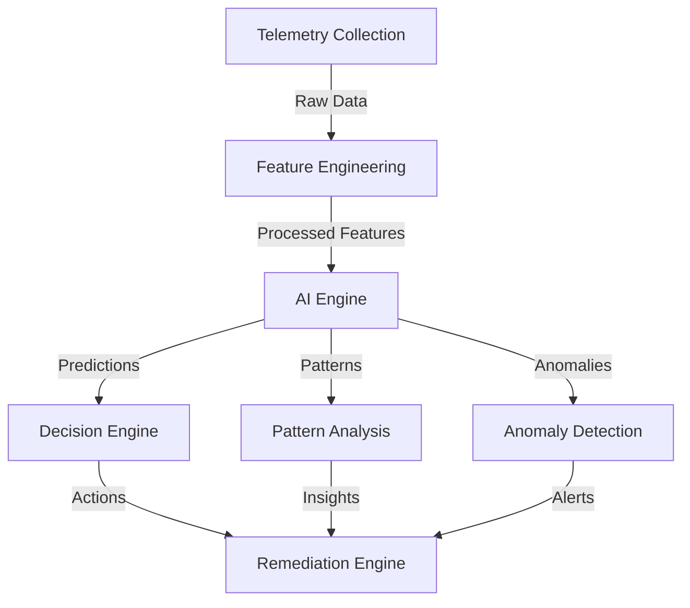

# AI Components Documentation

## Overview

The Azure Arc Framework includes advanced AI capabilities for predictive analytics, pattern recognition, and automated remediation. This document details the AI components and their integration within the framework.

## Architecture



## Python AI Engine Details

The Python AI engine, primarily located under `src/Python/`, performs the heavy lifting for data analysis, pattern recognition, and predictive modeling.

### 1. Entrypoint: `invoke_ai_engine.py`
    *   **Role**: Acts as the command-line interface (CLI) for the Python AI engine, primarily called by the `Get-PredictiveInsights.ps1` PowerShell cmdlet.
    *   **Inputs**: Accepts arguments like `--servername` and `--analysistype`.
    *   **Current State**: This script currently utilizes a `PlaceholderPredictiveAnalyticsEngine`. This placeholder simulates the output structure of a fully implemented engine, providing deterministic JSON responses based on input arguments. This allows for end-to-end testing of the PowerShell-Python interaction while the more complex Python components are being fully developed.

### 2. Telemetry Processing: `TelemetryProcessor`
    *   **Class**: `src/Python/analysis/telemetry_processor.py::TelemetryProcessor`
    *   **Purpose**: Cleans raw telemetry data, extracts fundamental features, detects anomalies and trends, and generates initial insights.
    *   **Key Functionalities**:
        *   `_handle_missing_values`: Fills missing data using configurable strategies (e.g., mean for numerical, 'unknown' for categorical, `False` for boolean).
        *   `_extract_features` & `_prepare_feature_matrix`: Prepares data for anomaly detection. Feature selection for the matrix is driven by `config['anomaly_detection_features']`. The `_extract_features` method now aims to produce a flat dictionary of features.
        *   `_calculate_derived_features`: Computes new features like `cpu_to_memory_ratio`, `cpu_usage_volatility`, `memory_usage_trend_slope`, and `requests_per_minute`. Calculations are designed to be robust (e.g., handling division by zero) and their execution can be toggled via configuration.
        *   `_detect_anomalies`: Uses Mahalanobis distance on PCA-transformed features. The percentile for thresholding is configurable.
        *   `_get_anomalous_features`: Identifies the actual feature values that were part of an anomalous observation.
        *   `_calculate_period_trends`: Uses `scipy.stats.linregress` for trend detection (slope, p-value, etc.) on features specified in `config['trend_features']`.
        *   `_detect_periodic_patterns`: Employs FFT (Fast Fourier Transform) for seasonality detection in columns specified in `config['fft_features']`.
        *   `_detect_correlations`: Calculates Pearson correlation for features in `config['correlation_features']` and identifies pairs exceeding `config['correlation_threshold']`.
        *   `_detect_anomalous_patterns`: Identifies occurrences of multi-metric anomaly patterns based on rules defined in `config['multi_metric_anomaly_rules']`.
        *   `_generate_insights`: Synthesizes findings from anomaly and trend detection into human-readable insights, considering significance (e.g., p-values for trends).

### 3. Pattern Analysis: `PatternAnalyzer`
    *   **Class**: `src/Python/analysis/pattern_analyzer.py::PatternAnalyzer`
    *   **Purpose**: Identifies various types of patterns in telemetry data, including temporal, behavioral, failure-related, and performance patterns.
    *   **Key Functionalities**:
        *   **Temporal Patterns**: `analyze_daily_patterns`, `analyze_weekly_patterns`, `analyze_monthly_patterns` identify peak times/days and seasonality strength using aggregation and autocorrelation. Thresholds (e.g., `daily_peak_percentile_threshold`) are configurable.
        *   **Behavioral Patterns**: `analyze_behavioral_patterns` uses DBSCAN clustering on a configurable list of features (`config['behavioral_features']`). DBSCAN parameters (`eps`, `min_samples`) are also configurable. `prepare_behavioral_features` prepares the data for clustering.
        *   **Failure Patterns**:
            *   `identify_common_failure_causes`: Performs frequency counts on 'error_type' or 'failure_category' columns.
            *   `identify_failure_precursors`: Simplified analysis comparing metric averages in a configurable window before 'failure_occurred' events to overall averages.
            *   `analyze_failure_impact`: Calculates statistics from 'downtime_minutes' and 'affected_services_count' if available.
        *   **Performance Patterns**:
            *   `analyze_resource_usage_patterns`: Calculates descriptive stats for key metrics (from `config['performance_metrics']`) and identifies periods of sustained high usage.
            *   `identify_bottlenecks`: Uses configurable rules (`config['bottleneck_rules']`) to detect concurrent metric breaches indicating bottlenecks.
            *   `analyze_performance_trends`: Uses `scipy.stats.linregress` for trend analysis on `config['performance_metrics']`.
        *   All analysis methods aim to return a dictionary including a `recommendations` list.

### 4. Root Cause Analysis: `RootCauseAnalyzer`
    *   **Class**: `src/Python/analysis/RootCauseAnalyzer.py::RootCauseAnalyzer`
    *   **Purpose**: Provides a hypothesized root cause for incidents by integrating rule-based estimation, explainability, and pattern analysis.
    *   **Components**:
        *   `SimpleRCAEstimator`: A rule-based component that matches keywords from incident descriptions and metric thresholds (defined in `config['rca_estimator_config']['rules']`) to predefined causes, recommendations, and impact scores.
        *   `SimpleRCAExplainer`: Generates template-based explanations for the identified causes, detailing trigger reasons and recommended actions.
    *   **Integration**: Utilizes `PatternAnalyzer` to include contextual patterns in its final report.
    *   **Output**: Produces a structured report including the incident description, predicted root causes (with confidence, impact, recommendation, and trigger reason), primary suspected cause, explanations, identified contextual patterns from `PatternAnalyzer`, and a consolidated list of actionable recommendations.

### 5. Feature Engineering: `FeatureEngineer`
    *   **Class**: `src/Python/predictive/feature_engineering.py::FeatureEngineer`
    *   **Purpose**: Transforms raw telemetry data into a rich feature set suitable for training predictive models.
    *   **Key Stages & Features**:
        *   **Initial Feature Selection**: Selects a baseline set of numerical and categorical features from the input data based on configuration (`config['original_numerical_features']`, `config['original_categorical_features']`).
        *   **Temporal Features**: Creates features like hour, day of week, cyclical sin/cos transformations from 'timestamp' columns.
        *   **Statistical Features**: Generates rolling window statistics (mean, std, min, max for various window sizes) and lag features for columns specified in `config['statistical_feature_columns']`.
        *   **Interaction Features**: Creates polynomial interaction features (product, ratio, sum, diff) between columns listed in `config['interaction_feature_columns']`.
        *   **NaN Handling**: Employs a dedicated `_handle_missing_values` method using configurable strategies for numerical (mean, median, zero) and categorical (mode, 'unknown') columns.
        *   **Scaling**: Applies `StandardScaler` to numerical features. Manages fit/transform state.
        *   **Encoding**: Applies `OneHotEncoder` to categorical features. Manages fit/transform state per column.
        *   **Feature Selection**: Uses `SelectKBest` with a configurable number of features (`k_best_features`) and scoring function (`f_classif` or `f_regression` based on config) if a target variable is provided. Includes alignment of features and target to handle NaNs.
    *   **Output**: Returns the engineered DataFrame and metadata about the features.

### 6. Model Training: `ArcModelTrainer`
    *   **Class**: `src/Python/predictive/model_trainer.py::ArcModelTrainer`
    *   **Purpose**: Trains various predictive models (health, failure, anomaly detection) based on configurations.
    *   **Key Functionalities**:
        *   `prepare_data`: Prepares data for a specific model type by selecting features (based on `config['features'][model_type]['required_features']`), handling missing values (via its own `handle_missing_values` method with configured strategy), and scaling numerical features using `StandardScaler`. It separates and returns the target variable if applicable. Returns the feature names in order.
        *   **Model Training**: Trains `RandomForestClassifier` for health and failure prediction, and `IsolationForest` for anomaly detection. Model hyperparameters (e.g., `n_estimators`, `max_depth`, `contamination`, `class_weight`) are sourced from `config['models'][model_type]`. Uses `train_test_split` for supervised models.
        *   **Evaluation**: For classification models, logs `classification_report` and `confusion_matrix`. For `IsolationForest`, logs score ranges.
        *   **Artifact Saving**: Saves trained models (`.pkl`), corresponding scalers (`.pkl`), and feature information (a dictionary containing the ordered list of feature `names` and their `importances`, as `.pkl`) using `joblib`.
    *   `update_models_with_remediation`: Placeholder for future online learning/retraining logic; currently logs receipt of data.

### 7. Prediction: `ArcPredictor`
    *   **Class**: `src/Python/predictive/predictor.py::ArcPredictor`
    *   **Purpose**: Loads pre-trained models and associated artifacts (scalers, feature information) to make predictions on new data.
    *   **Key Functionalities**:
        *   `load_models`: Loads models, scalers, and feature information (ordered list of names and importance scores map) from a specified directory. This metadata is crucial for ensuring consistent feature preparation.
        *   `prepare_features`: Takes new telemetry data (dictionary) and a `model_type`. It uses the loaded ordered feature list for that `model_type` to construct a NumPy array in the exact order expected by the model, handling missing features by defaulting to 0.0.
        *   **Prediction Methods**: Provides `predict_health`, `detect_anomalies`, and `predict_failures`. These methods first call `prepare_features`, then apply the loaded scaler to the raw feature array, and finally use the corresponding model to make predictions.
        *   `calculate_feature_impacts`: Calculates simple feature impacts by multiplying the scaled feature value by its importance score.

### 8. Remediation Learning: `ArcRemediationLearner`
    *   **Class**: `src/Python/predictive/ArcRemediationLearner.py::ArcRemediationLearner`
    *   **Purpose**: Learns from the outcomes of remediation actions and provides data-driven remediation recommendations.
    *   **Key Functionalities**:
        *   `learn_from_remediation`: Updates `success_patterns` based on `remediation_data`. `success_patterns` track the success rate, attempt counts, and context summaries for `(error_type, action_taken)` pairs. It no longer trains a local model incrementally.
        *   `get_recommendation`: Generates recommendations by:
            1.  Checking `success_patterns` for actions with high success rates for the given error context.
            2.  Querying the `ArcPredictor` for AI-driven failure/health predictions and deriving potential actions.
            3.  Combining and prioritizing these insights, returning a structured recommendation with action, confidence, source, and alternatives.
        *   Interacts with `ArcModelTrainer` via `update_models_with_remediation` to signal that new remediation data is available, allowing the trainer to potentially update its models (though this part in the trainer is still basic).

### 9. Orchestration: `PredictiveAnalyticsEngine`
    *   **Class**: `src/Python/predictive/predictive_analytics_engine.py::PredictiveAnalyticsEngine`
    *   **Purpose**: Orchestrates various AI components to provide higher-level analyses, such as deployment risk assessment.
    *   **Integration**: Initializes and uses instances of `ArcModelTrainer` (though primarily for its structure in some flows, not active training during prediction), `ArcPredictor`, and `PatternAnalyzer`.
    *   **`analyze_deployment_risk`**: Combines insights from `ArcPredictor` (health, failure predictions) and `PatternAnalyzer` to calculate an overall risk score and level for a server/deployment. It generates consolidated recommendations.

## PowerShell Integration Layer

The framework integrates AI capabilities and core deployment functionalities through several PowerShell functions.

### Core Deployment Functions

-   **`Initialize-ArcDeployment.ps1`**:
    *   **Role**: Prepares the Azure environment for Arc deployments. This includes ensuring the correct Azure context is set (subscription, tenant), and validating or creating the target Resource Group.
    *   **Key Parameters**: `-SubscriptionId`, `-ResourceGroupName`, `-Location`, `-TenantId` (optional), `-Tags` (optional).
    *   **Features**: Supports `-WhatIf` and `-Confirm` due to `SupportsShouldProcess`. It checks for dependent Az PowerShell modules (Az.Accounts, Az.Resources) and an active Azure login.
    *   **Output**: Returns a PSCustomObject with details of the targeted/created resource group (Name, Location, ProvisioningState, Tags) and the Azure context.
    *   **Dependencies**: Requires Az.Accounts and Az.Resources modules to be installed and the user to be logged into Azure.

-   **`New-ArcDeployment.ps1`**:
    *   **Role**: Constructs the `azcmagent connect` command required to onboard a server to Azure Arc. It gathers all necessary parameters for the agent connection.
    *   **Key Parameters**: `-ServerName`, `-ResourceGroupName`, `-SubscriptionId`, `-Location`, `-TenantId`. Optional parameters include `-CorrelationId`, `-Tags`, `-Cloud`, `-ProxyUrl`, `-ProxyBypass`, `-ServicePrincipalAppId` (with `-ServicePrincipalSecret`), `-AgentInstallationScriptPath`, and `-AgentInstallationArguments`.
    *   **Functionality**: The script dynamically builds the `azcmagent connect` command string. The current version displays this command and instructs the user to execute it manually on the target server. Placeholder logic exists for future direct agent installation or command execution.
    *   **Features**: Supports `-WhatIf` and `-Confirm` for operations like conceptual agent installation script execution.

### AI Focused Functions

-   **`Get-PredictiveInsights.ps1`**:
    *   **Role**: Retrieves predictive insights for a specified server by invoking the Python AI engine.
    *   **Key Parameters**: `-ServerName`, `-AnalysisType` (Full, Health, Failure, Anomaly), `-PythonExecutable` (optional path to python/python3), `-ScriptPath` (optional path to `invoke_ai_engine.py`).
    *   **Interaction**: Calls `invoke_ai_engine.py`, passing server name and analysis type as arguments. It captures stdout from the Python script.
    *   **Output**: Returns a PowerShell custom object converted from the JSON output of the Python script. This object contains the predictive insights.
    *   **Error Handling**: Includes checks for Python executable, Python script path, script execution errors (non-zero exit code), and JSON parsing failures. Error details from the Python script (if available in stderr) are logged.
-   **Other AI Functions** (e.g., `Start-ArcTroubleshooter`, `Invoke-AIPatternAnalysis`, `Start-AIEnhancedTroubleshooting`): These functions provide further AI-driven capabilities for diagnostics and analysis. Refer to their respective help or source for detailed parameters. The module manifest (`AzureArcFramework.psd1`) is the source of truth for exported function names like `Start-ArcTroubleshooter`.

-   **Remediation Workflow (`Start-AIRemediationWorkflow.ps1`)**:
    *   **Role**: Bridges diagnostics to remediation by chaining `Find-IssuePatterns` (pattern detection) and `Get-RemediationAction` (rule lookup) with validation and `Start-RemediationAction` execution. Emits telemetry counts for pattern/action detection.
    *   **Inputs**: Diagnostics or telemetry object (or path), optional JSON rule packs for issue patterns and remediation mappings (`-IssuePatternDefinitionsPath`, `-RemediationRulesPath`), and optional validation rules (`-ValidationRulesPath`). Defaults fall back to built-in patterns/rules if paths are omitted.
    *   **Behavior**: Resolves `IssueId` → `RemediationActionId`, merges derived validation with rule-defined steps, executes actions in `Automatic` or `ManualApproval` mode, and returns a summary containing `PatternsDetected`, `ActionsResolved`, and `ActionsExecuted` alongside per-action results.
    *   **Extensibility**: Pattern operators support equals/contains as well as `StartsWith`, `EndsWith`, and numeric thresholds; remediation rules can be supplied via JSON to avoid code changes and align with CI fixtures.

### 2. Automation Integration

```powershell
# AI-driven remediation
Start-AIRemediationWorkflow -ServerName $ServerName -Insights $insights

# Automated decision making
Invoke-AIDecision -Context $context -Options $options
```

## Model Training Process (Conceptual)

The model training process, primarily managed by `ArcModelTrainer` and orchestrated potentially by higher-level scripts, involves:
1.  **Data Collection**: Gathering historical telemetry and operational data.
2.  **Feature Engineering**: Using `FeatureEngineer` to process raw data into features suitable for model training. The specific features engineered are guided by `feature_engineering` and `model_config.features` sections in `ai_config.json`.
3.  **Data Preparation**: `ArcModelTrainer.prepare_data` takes the (potentially already engineered) data, selects the final set of features required for a specific model, handles any remaining missing values, scales numerical features, and separates the target variable.
4.  **Model Training**: For each model type (health, failure, anomaly), `ArcModelTrainer` initializes the scikit-learn model with hyperparameters from `ai_config.json` and fits it to the prepared data.
5.  **Evaluation**: Basic evaluation metrics are logged (e.g., classification reports).
6.  **Model Saving**: Trained models, scalers, and feature information (ordered names and importances) are saved to disk using `joblib` by `ArcModelTrainer.save_models`. These artifacts are then used by `ArcPredictor` at inference time.

# This section was replaced by the detailed Python AI Engine Details above.
# The old content is removed by the diff.

## Configuration (`src/config/ai_config.json`)

The behavior of the Python AI engine components is heavily driven by `src/config/ai_config.json`. This file contains detailed configurations for:
-   **Telemetry Processing**: Feature lists for anomaly detection, trends, FFT, correlations; thresholds for various detections.
-   **Pattern Analysis**: Feature lists for behavioral clustering, DBSCAN parameters, performance metrics to track, bottleneck rules.
-   **Root Cause Analysis**: Rules for `SimpleRCAEstimator` (keywords, metric thresholds, cause strings, recommendations, impacts).
-   **Feature Engineering**: Lists of original features to use, columns for statistical and interaction feature generation, NaN fill strategies, feature selection parameters (k, score function).
-   **Model Training (`model_config`)**:
    *   `features`: Defines, per model type, the list of required input features (which can be the output of `FeatureEngineer`), target column name, and missing value strategy for `ArcModelTrainer`'s `prepare_data` step.
    *   `models`: Specifies scikit-learn model types and their hyperparameters (e.g., `n_estimators`, `max_depth`, `contamination`, `class_weight`) for health prediction, anomaly detection, and failure prediction.
-   **Remediation Learning**: Features for context logging, success rate thresholds for recommending from patterns.

This centralized configuration allows for fine-tuning the AI engine's behavior without code changes. (The generic JSON examples previously in this document have been removed in favor of this description of the actual configuration file).

## Best Practices & Troubleshooting
(Sections on Best Practices, Troubleshooting, Performance Optimization, Security, Monitoring, and Future Enhancements can be reviewed and updated in subsequent iterations as the framework matures beyond the current focus on core component implementation.)
# The old "Feature Configuration" and its JSON example are removed by this replacement.
# The generic "AI Configuration" JSON example is also removed.

## Best Practices

### 1. Model Management
- Regular model retraining
- Performance monitoring
- Version control
- Validation procedures
- Deployment strategies

### 2. Feature Engineering
- Data normalization
- Feature selection
- Dimensionality reduction
- Missing data handling
- Outlier detection

### 3. Integration
- Error handling
- Logging
- Performance optimization
- Resource management
- Security considerations

## Troubleshooting

### 1. Common Issues

#### Model Performance
```powershell
# Check model performance
Test-AIModelPerformance -ModelType "HealthPrediction"

# Validate predictions
Test-PredictionAccuracy -Predictions $predictions
```

#### Feature Engineering
```powershell
# Validate features
Test-FeatureQuality -Features $features

# Check data quality
Test-DataQuality -TelemetryData $telemetryData
```

### 2. Diagnostics

```powershell
# Get AI component status
Get-AIComponentStatus

# Export diagnostic data
Export-AITelemetry -Path ".\Diagnostics"
```

## Performance Optimization

### 1. Resource Usage
- Batch processing
- Caching strategies
- Memory management
- CPU optimization
- Parallel processing

### 2. Scaling
- Load balancing
- Resource allocation
- Queue management
- Buffer handling
- Throttling mechanisms

## Security Considerations

### 1. Data Protection
- Data encryption
- Access control
- Audit logging
- Data retention
- Privacy compliance

### 2. Model Security
- Input validation
- Output sanitization
- Model versioning
- Access controls
- Audit trails

## Monitoring and Metrics

### 1. Performance Metrics
```powershell
# Get AI performance metrics
Get-AIMetrics -TimeRange "24h"

# Monitor prediction accuracy
Get-PredictionMetrics -ModelType "HealthPrediction"
```

### 2. Health Monitoring
```powershell
# Monitor AI component health
Get-AIComponentHealth

# Check model health
Test-ModelHealth -ModelType "FailurePrediction"
```

## Future Enhancements

### 1. Planned Features
- Enhanced pattern recognition
- Real-time prediction updates
- Automated model optimization
- Advanced anomaly detection
- Integrated feedback loops

### 2. Integration Points
- Additional data sources
- External AI services
- Custom model support
- Enhanced visualization
- Advanced reporting