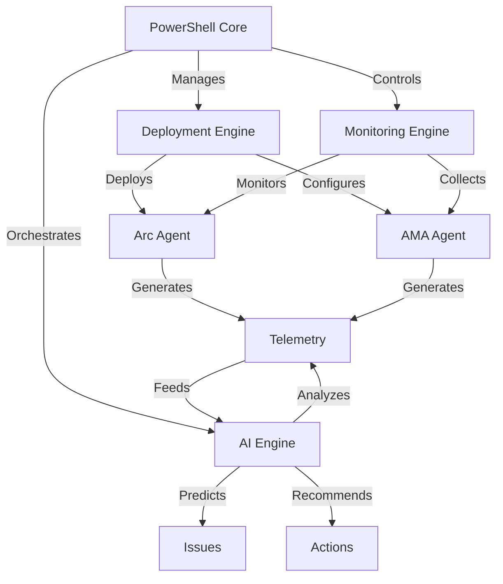
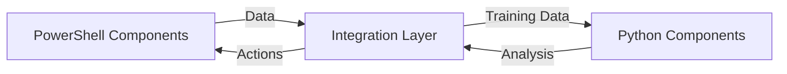
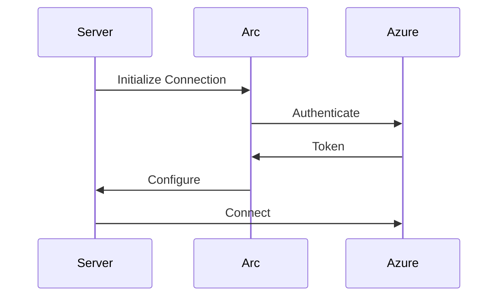
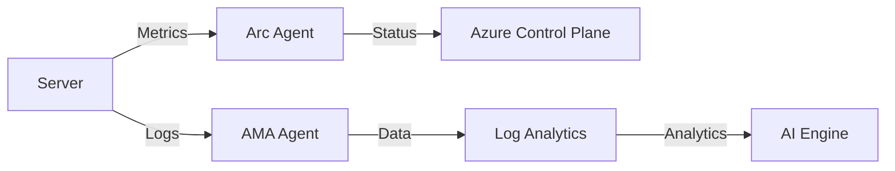
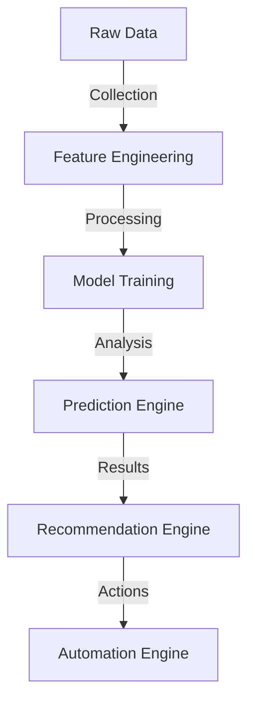
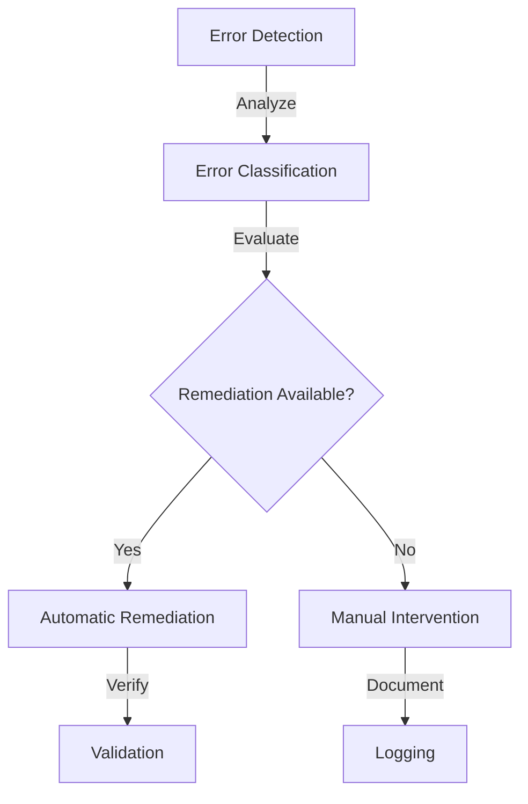
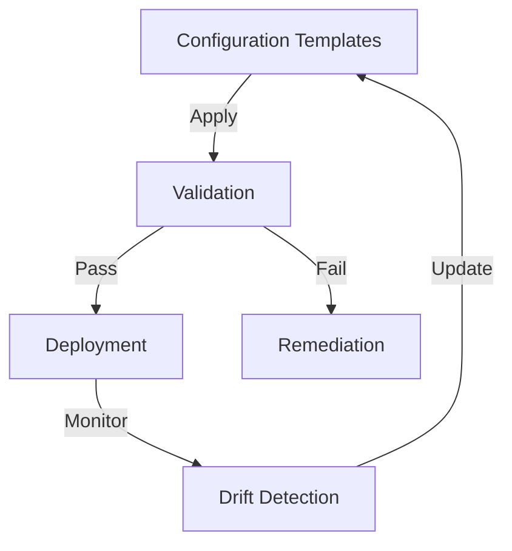
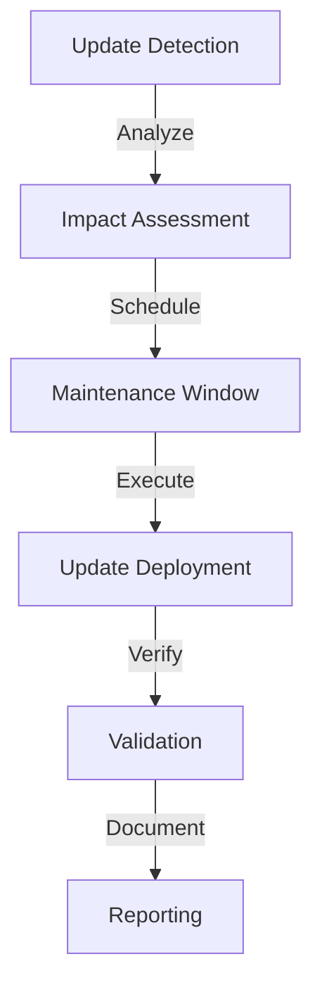

# Azure Arc Framework Architecture

## Overview

The Azure Arc Framework is a comprehensive solution for deploying, managing, and monitoring Azure Arc-enabled servers. It combines PowerShell and Python components to provide advanced automation, AI-driven insights, and robust error handling.

## System Architecture

## Component Architecture

### 1. PowerShell Core Components

#### Deployment Engine
- Prerequisites validation
- Agent deployment orchestration
- Configuration management
- Error handling and rollback
- Validation and verification

#### Monitoring Engine
- Health checks
- Performance monitoring
- Log collection
- Alert management
- Status reporting

#### Management Engine
- Configuration updates
- Policy enforcement
- Security compliance
- Resource management
- Maintenance automation

### 2. Python AI Components

#### Predictive Analytics
- Failure prediction
- Performance forecasting
- Resource optimization
- Pattern recognition
- Anomaly detection

#### Machine Learning
- Model training
- Feature engineering
- Pattern analysis
- Recommendation generation
- Continuous learning

### 3. Integration Layer

## Security Architecture

### Authentication Flow

### Security Components
- Certificate management
- TLS configuration
- Network security
- Identity management
- Access control

## Data Flow

### Telemetry Collection

### AI Processing

## Error Handling

### Error Flow

## Scalability Architecture

### Deployment Scaling
- Parallel execution
- Batch processing
- Resource throttling
- Queue management
- State management

### Monitoring Scaling
- Distributed collection
- Data aggregation
- Load balancing
- Buffer management
- Stream processing

## Integration Points

### Azure Services
- Azure Arc
- Azure Monitor
- Azure Policy
- Azure Automation
- Azure Security Center

### External Systems
- SIEM integration
- CMDB integration
- Ticketing systems
- Monitoring tools
- Compliance systems

## Configuration Management

### Configuration Flow

## Monitoring Architecture

### Monitoring Components
- Health monitoring
- Performance monitoring
- Security monitoring
- Compliance monitoring
- Cost monitoring

## Maintenance and Updates

### Update Flow
