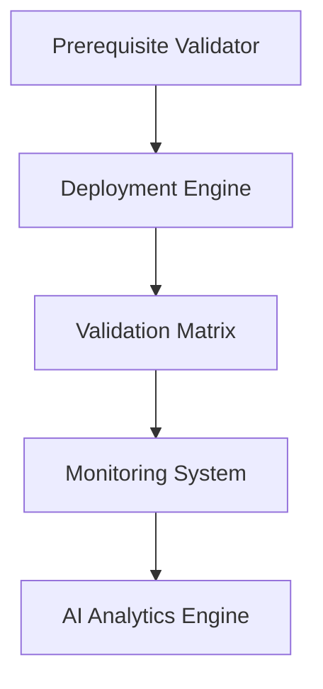
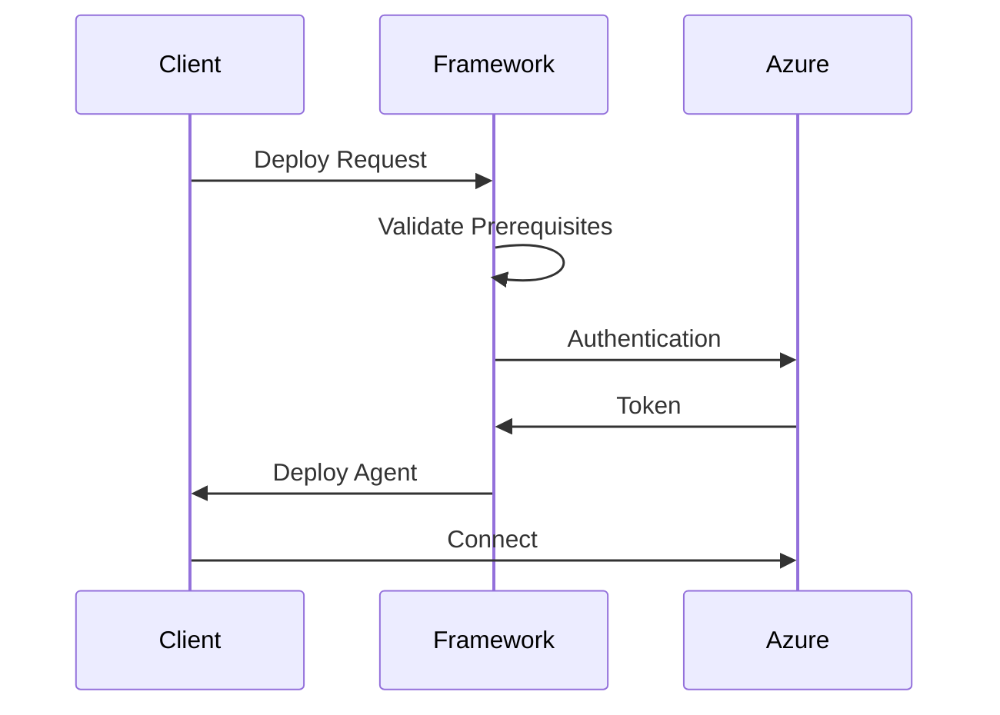

# Architecture Overview

## System Components

### 1. Core Components

### 2. Data Flow

## Security Architecture

### 1. Authentication Flow
- Azure AD Service Principal
- Managed Identity Support
- Certificate-based authentication

### 2. Network Security
- TLS 1.2 requirement
- Proxy support
- Firewall considerations

## Scalability Considerations

### 1. Deployment Scaling
- Parallel deployment capabilities
- Resource throttling
- Error handling and retry logic

### 2. Monitoring Scaling
- Distributed logging
- Metric aggregation
- Alert management

## Integration Points

### 1. Azure Services
- Azure Arc
- Azure Monitor
- Azure Policy
- Azure Automation

### 2. External Systems
- SIEM integration
- CMDB integration
- Ticketing systems

## Error Handling

### 1. Retry Mechanism
- Exponential backoff
- Circuit breaker pattern
- Dead letter handling

### 2. Rollback Procedures
- State management
- Transaction logging
- Recovery procedures