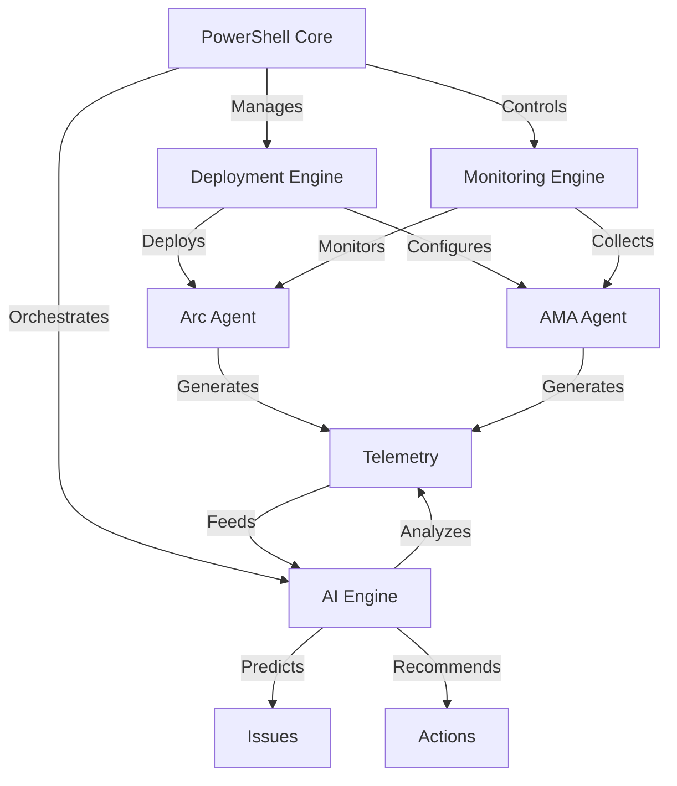
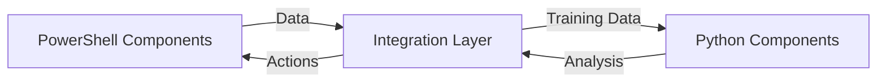
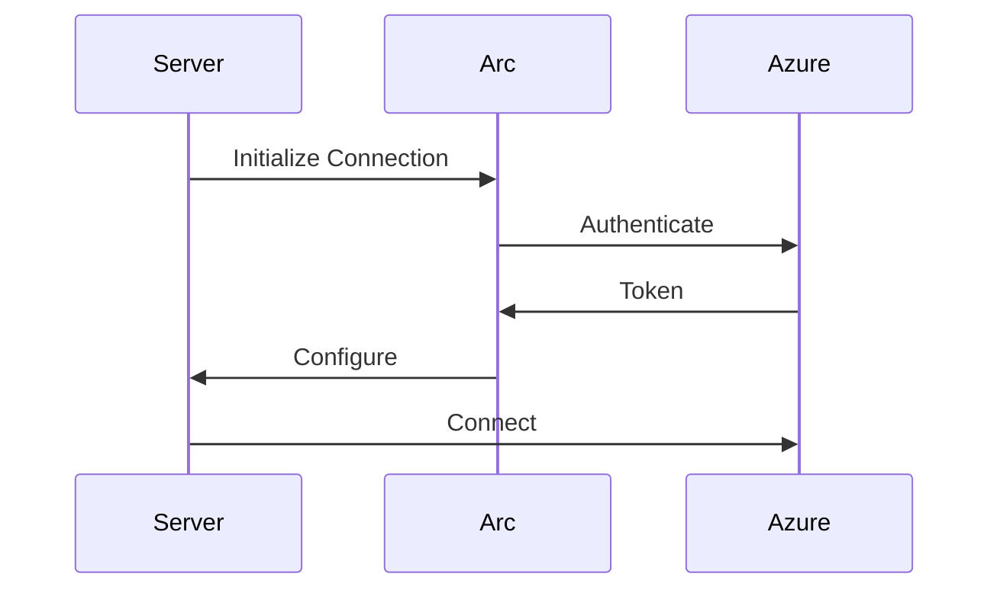
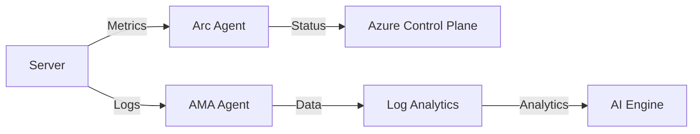
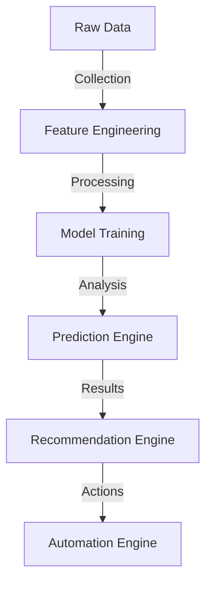
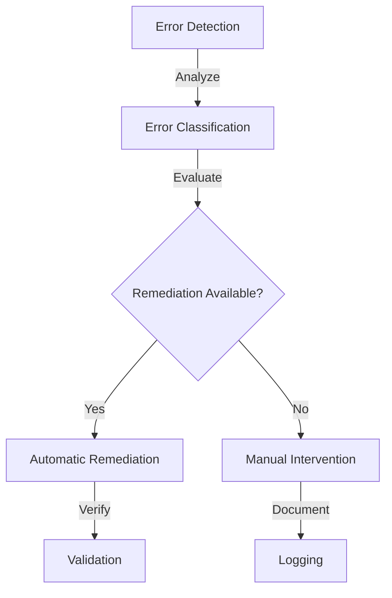
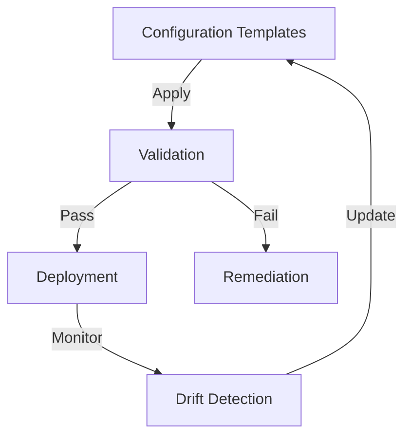
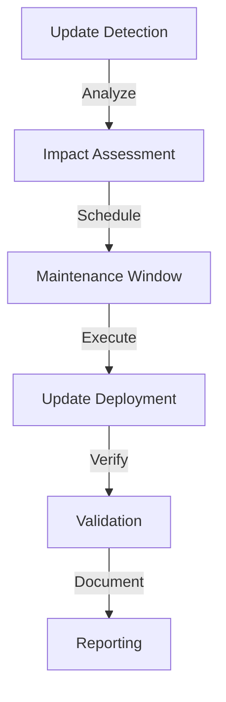

# Azure Arc Framework Architecture

## Overview

The Azure Arc Framework is an enterprise-grade automation framework for Azure Arc agent deployment, management, and monitoring, built from real-world experience with 5000+ server deployments. It combines PowerShell orchestration with Python AI/ML components to provide advanced automation, predictive insights, and robust error handling.

## System Architecture

```mermaid
graph TD
    A[PowerShell Core] -->|Manages| B[Deployment Engine]
    A -->|Controls| C[Monitoring Engine]
    A -->|Orchestrates| D[AI Engine]
    
    B -->|Deploys| E[Arc Agent]
    B -->|Configures| F[AMA Agent]
    
    C -->|Monitors| E
    C -->|Collects| F
    
    D -->|Analyzes| G[Telemetry]
    D -->|Predicts| H[Issues]
    D -->|Recommends| I[Actions]
    
    G -->|Feeds| D
    E -->|Generates| G
    F -->|Generates| G
```

## Component Architecture

### 1. PowerShell Core Components

#### Deployment Engine
- Prerequisites validation
- Agent deployment orchestration
- Configuration management
- Error handling and rollback
- Validation and verification

#### Monitoring Engine
- Health checks
- Performance monitoring
- Log collection
- Alert management
- Status reporting

#### Management Engine
- Configuration updates
- Policy enforcement
- Security compliance
- Resource management
- Maintenance automation

### 2. Python AI Components

#### PredictiveAnalyticsEngine
- Orchestrates telemetry processing, pattern analysis, and model inference
- Integrates TelemetryProcessor, PatternAnalyzer, and ArcPredictor
- Provides predictive failure analysis and root cause analysis

#### TelemetryProcessor
- Preprocesses server telemetry data
- Performs anomaly detection
- Feeds cleaned data to pattern analyzers and predictors

#### PatternAnalyzer
- Recognizes temporal, behavioral, and failure patterns
- Analyzes performance and security trends
- Generates insights for predictive modeling

#### ArcPredictor
- Executes model inference for failure prediction
- Loads trained models and scalers from config-specified directories
- Returns structured predictions with confidence scores

#### RootCauseAnalyzer
- Performs automated root cause analysis on detected issues
- Correlates patterns and anomalies
- Provides actionable recommendations

#### ArcRemediationLearner
- Implements self-learning remediation strategies
- Learns from successful remediation outcomes
- Adapts recommendations based on historical data

### 3. Integration Layer

```mermaid
graph LR
    A[PowerShell Components] -->|Data| B[Integration Layer]
    C[Python Components] -->|Analysis| B
    B -->|Actions| A
    B -->|Training Data| C
```

## Security Architecture

### Authentication Flow

```mermaid
sequenceDiagram
    participant Server
    participant Arc
    participant Azure
    Server->>Arc: Initialize Connection
    Arc->>Azure: Authenticate
    Azure->>Arc: Token
    Arc->>Server: Configure
    Server->>Azure: Connect
```

### Security Components
- Certificate management
- TLS configuration
- Network security
- Identity management
- Access control

## Data Flow

### Telemetry Collection

```mermaid
graph LR
    A[Server] -->|Metrics| B[Arc Agent]
    A -->|Logs| C[AMA Agent]
    B -->|Status| D[Azure Control Plane]
    C -->|Data| E[Log Analytics]
    E -->|Analytics| F[AI Engine]
```

### AI Processing

```mermaid
graph TD
    A[Raw Data] -->|Collection| B[Feature Engineering]
    B -->|Processing| C[Model Training]
    C -->|Analysis| D[Prediction Engine]
    D -->|Results| E[Recommendation Engine]
    E -->|Actions| F[Automation Engine]
```

## Error Handling

### Error Flow

```mermaid
graph TD
    A[Error Detection] -->|Analyze| B[Error Classification]
    B -->|Evaluate| C{Remediation Available?}
    C -->|Yes| D[Automatic Remediation]
    C -->|No| E[Manual Intervention]
    D -->|Verify| F[Validation]
    E -->|Document| G[Logging]
```

## Scalability Architecture

### Deployment Scaling
- Parallel execution
- Batch processing
- Resource throttling
- Queue management
- State management

### Monitoring Scaling
- Distributed collection
- Data aggregation
- Load balancing
- Buffer management
- Stream processing

## Integration Points

### Azure Services
- Azure Arc
- Azure Monitor
- Azure Policy
- Azure Automation
- Azure Security Center

### External Systems
- SIEM integration
- CMDB integration
- Ticketing systems
- Monitoring tools
- Compliance systems

## Configuration Management

### Configuration Flow

```mermaid
graph TD
    A[Configuration Templates] -->|Apply| B[Validation]
    B -->|Pass| C[Deployment]
    B -->|Fail| D[Remediation]
    C -->|Monitor| E[Drift Detection]
    E -->|Update| A
```

## Monitoring Architecture

### Monitoring Components
- Health monitoring
- Performance monitoring
- Security monitoring
- Compliance monitoring
- Cost monitoring

## Maintenance and Updates

### Update Flow

```mermaid
graph TD
    A[Update Detection] -->|Analyze| B[Impact Assessment]
    B -->|Schedule| C[Maintenance Window]
    C -->|Execute| D[Update Deployment]
    D -->|Verify| E[Validation]
    E -->|Document| F[Reporting]
```